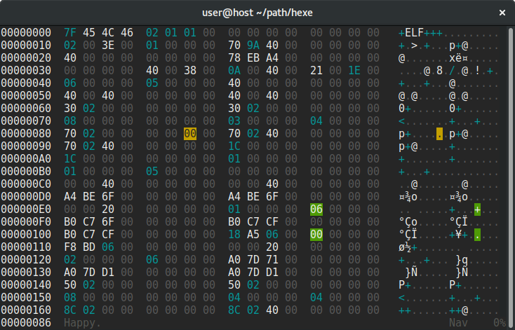

# hexe

`hexe` is a simple terminal-based hex editor.

**Features:**

 * Unlimited undo and redo
 * Set bookmarks at any offset and jump between marks
 * Freely adjustable column width
 * Changeable key mappings

**Features hexe does NOT have:**

 * Unlimited file size
 * Multiple buffers

## Usage

`hexe` is always invoked on a single file:

    hexe <filename>

The following command will print a table of all keys and functions:

    hexe --list-bindings

To bookmark locations from the command line, call `hexe` like this:

    hexe -M 0=entry -M 446=part1 -M 462=part2 -M 478=part3 -M 494=part4 -M 510=magic sector.bin

You can also put this information (along with any other commands) in a file 
(`mbr.cmd`):

    mark 0   "bootloader entry point"
    mark 446 "partition 1"
    mark 462 "partition 2"
    mark 478 "partition 3"
    mark 494 "partition 4"
    mark 510 "magic 55AA"

And let `hexe` load it at startup:

    hexe --script mbr.cmd sector.bin

At startup, `hexe` reads `.config/hexe/config` automatically. It may contain 
any commands, for example:

    column-width =8
    set-mode char-over
    bind hex-nav C-PageDown scroll line+10
    bind line-nav Tab cancel
    # insert a null character when Ctrl+y is pressed
    bind hex-over C-y set-mode hex-ins, feed '0', feed '0', set-mode hex-over

Refer to `hexe --help` for a list of all command-line options.
